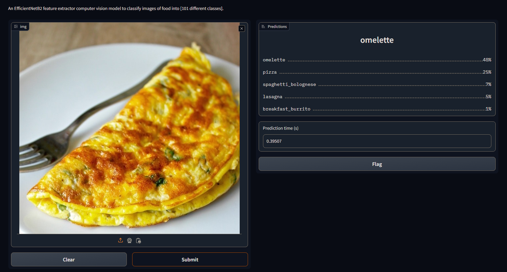

<h1> FoodVision 🍔👁 </h1>

  

### Colab - For Demo

| Colab | Info
| --- | --- |
 | Fooocus Official

### What is it:
- A food image classifier model which is build using the Food101 dataset and the model used is EffNetB2
- The model is lightweight, fast and capable of classifying 101 different food images.

### How to run it:
- Simply open the colab link given above and then run the cell, after some time it a public link for the demo of the model will be given to you
- The demo page will look similar to the image shown above, simply upload any image you wish to classify and the probabilties will be shown to you.

### The list of all 101 different food items is in the class_names.txt file.
